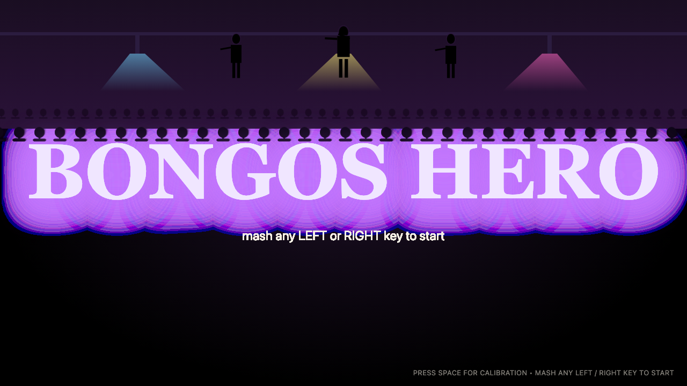
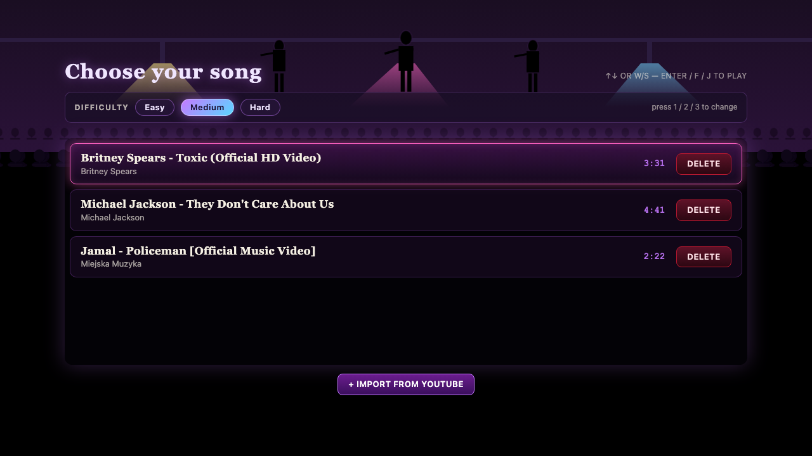
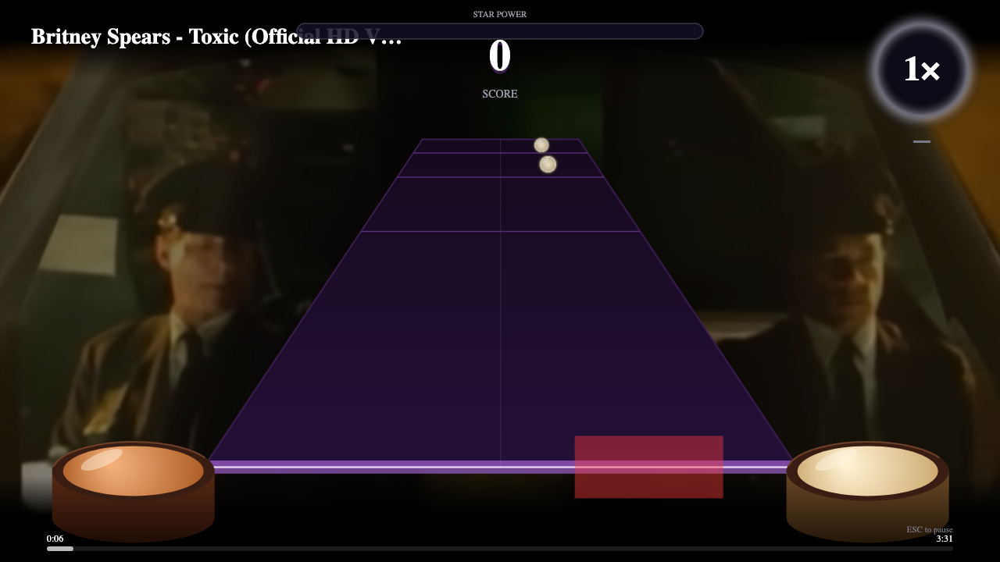

# Bongos Hero

> A 2-lane, keyboard-driven, PS2-Guitar-Hero-inspired rhythm game with automatic charting from any
> YouTube link.

Bongos Hero is a hobby rhythm game built around a two-key control scheme — `F` for the left bongo,
`J` for the right, `Space` for Star Power. Drop a YouTube URL into the importer and the server runs
the audio through `yt-dlp` → `ffmpeg` → `aubioonset` → a small heuristic charter, then writes a
playable chart to disk. There is no cloud, no account, no song redistribution: the audio you import
sits in `data/songs/` on your own machine until you delete it.

## Status

This is a personal/learning project. It is local-development only and depends on three external
tools (`yt-dlp`, `ffmpeg`, `aubio`) that you install yourself. Auto-charting is heuristic; results
will vary by track. **Only import audio you have the right to use** — you are responsible for the
copyright status of anything you put through the pipeline. The project ships zero songs and never
uploads any audio.

## Screenshots

| | |
| --- | --- |
|  | The title screen — mash any left- or right-half key to start, `Space` for the calibration scene. |
|  | Song select with the difficulty toggle (Easy / Medium / Hard) and import-from-YouTube button. |
|  | A song in play: tilted highway, perspective drum-head notes, animated bongos at the corners, and (when the source was a YouTube link) the original music video playing muted in the background. |

## Features

- Two-lane gameplay (left / right bongo) with a PS2-Guitar-Hero-styled tilted, trapezoidal
  highway.
- Keyboard-only controls — mash the **entire left half** of the keyboard for the left bongo and
  the **entire right half** for the right bongo (any single key works too: `F`/`J` is the
  classic). `Space` triggers Star Power.
- **Cartoon bongos at the bottom of the stage** that light up while held and fire a
  judgment-tinted halo + drumhead-squash animation on every hit.
- **Optional YouTube background video** — when a song was imported from a YouTube URL, the
  original music video plays muted as the gameplay backdrop, sample-accurately synced to the
  audio engine via 1 Hz drift correction. Falls back to the animated band/crowd backdrop if the
  video can't load (region-lock, age-gate, etc.).
- Three difficulty levels (`Easy` / `Medium` / `Hard`) with chart thinning + a per-hit score
  multiplier; remembered in `localStorage`.
- Real perspective drum-head note sprites (pre-rasterised once, blitted per frame) with per-lane
  colour coding.
- Five-judgment scoring (perfect / great / good / miss + stray taps), combo, multipliers up to
  `4×`, and Star Power that doubles the active multiplier.
- Automatic charting from any YouTube URL — onsets detected with `aubioonset`, classified into
  lanes via stereo balance + spectral centroid.
- Animated band silhouettes and a parallax crowd that pulse to the chart's inferred BPM (used
  whenever the YouTube backdrop is off).
- Synthetic SFX bank: every hit/miss/SP/metronome sound is generated deterministically in-browser
  at startup. Zero binary audio assets.
- Local latency calibration with a 100 BPM metronome tap test, persisted to `localStorage`.
- Persistent per-song library on disk at `data/songs/<id>/`.

## Prerequisites

| Tool         | Purpose                                       | macOS (Homebrew)         | Debian / Ubuntu (apt)              |
| ------------ | --------------------------------------------- | ------------------------ | ---------------------------------- |
| Node.js ≥ 20 | Workspace runtime (`engines.node` is `>=20`)  | `brew install node`      | `sudo apt install nodejs npm`      |
| npm ≥ 10     | Bundled with current Node 20+                 | (bundled)                | (bundled)                          |
| `yt-dlp`     | Download audio from YouTube                   | `brew install yt-dlp`    | `sudo apt install yt-dlp` (or `pipx install yt-dlp`) |
| `ffmpeg`     | Loudness-normalise + transcode to OGG/Opus    | `brew install ffmpeg`    | `sudo apt install ffmpeg`          |
| `aubio`      | Onset detection (`aubioonset` binary)         | `brew install aubio`     | `sudo apt install aubio-tools`     |

The server probes all three binaries on startup. If any are missing it logs (but does not exit) the
following error before continuing:

```
Missing required binaries: ytdlp, ffmpeg, aubioonset.

Install with Homebrew (macOS):
  brew install yt-dlp
  brew install ffmpeg
  brew install aubio

Install with apt (Debian/Ubuntu):
  sudo apt install yt-dlp   # or: pipx install yt-dlp
  sudo apt install ffmpeg
  sudo apt install aubio-tools
```

`/api/health` and `/api/songs` keep working without the binaries — only `/api/import` will fail.

## Quick start

```bash
git clone <this repo>
cd Bongos-Hero
npm install
npm run dev
```

Then open <http://localhost:5173>.

`npm run dev` starts both halves of the workspace in parallel:

- The Vite dev server on <http://localhost:5173>.
- The Fastify import/playback server on <http://localhost:5174> (configurable via `PORT`).

Vite proxies `/api/*` to the Fastify server (see `apps/web/vite.config.ts`), so the web app talks
to a single same-origin URL.

## Controls

All bindings use `KeyboardEvent.code` so they are layout-independent (AZERTY/Dvorak users get the
same physical keys).

> **Mash mode**: instead of just `F`/`J`, the play scene treats the **entire left half** of the
> keyboard as the *left bongo* and the **entire right half** as the *right bongo*. So
> ``Q W E R T A S D F G Z X C V B `1 2 3 4 5`` all hit left, and `Y U I O P H J K L N M , . /
> [ ] \ ; ' 6 7 8 9 0 - =` all hit right. Two presses on the same lane within 25 ms are
> coalesced into one hit, so smashing your palm registers as one bongo strike (cross-lane
> alternation is never coalesced). Modifier-held shortcuts (`Cmd+R`, `Ctrl+T`, etc.) still pass
> through to the browser. Reserved keys: `Space` = Star Power, `Esc` = pause.

### Title screen

| Key                              | Action                          |
| -------------------------------- | ------------------------------- |
| Any left/right key (e.g. `F`/`J`)| Continue to song select         |
| `Space`                          | Open latency calibration        |

### Song select

| Key                     | Action                          |
| ----------------------- | ------------------------------- |
| `↑` / `W`               | Move selection up               |
| `↓` / `S`               | Move selection down             |
| `Enter` / `F` / `J`     | Play the highlighted song       |
| `1` / `2` / `3`         | Set difficulty (Easy/Med/Hard)  |
| `Esc`                   | Back to title                   |

The "+ Import from YouTube" and per-row "Delete" buttons are mouse-only.

### Import

| Key      | Action                              |
| -------- | ----------------------------------- |
| `Enter`  | Submit the URL (focus in the input) |
| `Esc`    | Back to song select                 |

### In-game (play scene)

| Key                       | Action                                                |
| ------------------------- | ----------------------------------------------------- |
| Any left-side key         | Hit left bongo (mash anywhere on the left half)       |
| Any right-side key        | Hit right bongo (mash anywhere on the right half)     |
| `Space`                   | Activate Star Power (requires meter ≥ 50%)            |
| `Esc`                     | Pause / quit out of count-in to song select           |

### Pause overlay

| Key      | Action                          |
| -------- | ------------------------------- |
| `Esc`    | Resume                          |
| `Q`      | Quit to song select             |

### Results

| Key                 | Action                                |
| ------------------- | ------------------------------------- |
| `Enter` / `F` / `J` | Play the same song again (same diff.) |
| `Esc`               | Back to song select                   |

### Calibration

| Key                              | Action                                   |
| -------------------------------- | ---------------------------------------- |
| Any left/right key (e.g. `F`/`J`)| Tap to the 100 BPM metronome             |
| `Enter`                          | Save the median offset and exit          |
| `R`                              | Reset taps                               |
| `Esc`                            | Cancel and return to title               |

OS key auto-repeat is suppressed in-game (`event.repeat` is filtered), and held-key state is
cleared on `blur` / `visibilitychange` so a tab-switch never leaves a lane "stuck on".

### Difficulty

Pick a difficulty on the song-select screen (mouse, or `1`/`2`/`3`). The choice is remembered in
`localStorage` (`bongos.difficulty`) and applied to the same chart in real time:

| Level   | Min. spacing between notes | Score multiplier |
| ------- | -------------------------- | ---------------- |
| Easy    | 320 ms (~3 hits/s max)     | ×0.6             |
| Medium  | 180 ms                     | ×0.85            |
| Hard    | None — full chart          | ×1.0             |

Easy/Medium thin the auto-chart with a greedy min-spacing filter that prefers alternating lanes
within the spacing window, so the L↔R groove is preserved. Star Power phrases still fill at the
full 25% per phrase, so SP comes online faster on Easy. The score multiplier is applied per hit
so the HUD always shows an integer score.

## Importing a song

1. From the title screen press `F` or `J` to enter song select.
2. Click **+ Import from YouTube** (or pick "Import your first song" if your library is empty).
3. Paste a YouTube URL into the input and press `Enter` (or click **Import**).
4. The status line walks through the pipeline: `Queued → Downloading → Normalizing → Detecting
   onsets → Done!`. Total time scales roughly with the source song length (download + transcode
   are linear in duration; onset detection and feature extraction are sub-real-time on a typical
   laptop).
5. On success the new song lands in `data/songs/<random-uuid>/` containing:
   - `audio.ogg` — loudness-normalised Opus-in-Ogg (~128 kbps).
   - `chart.json` — `ChartV1` (notes, BPM, calibration offset).
   - `meta.json`  — `SongMeta` (title, artist, duration, source URL, timestamp).

**Legal note:** only import songs you have the right to use. Bongos Hero downloads audio locally
and stores it on your machine; nothing is uploaded or redistributed.

### YouTube video background

When a song's `meta.json` retains the original YouTube URL (set automatically by the importer),
the play scene also embeds the music video as a muted, dimmed backdrop behind the highway. The
audio still comes from the local OGG so timing is sample-accurate; the video is kept in sync via
1 Hz drift correction. If the embed can't load — region-locked, age-gated, ad-blocked, or just
slow — the canvas silently falls back to its animated band-and-crowd backdrop and gameplay
proceeds normally.

## How auto-charting works

The pipeline is implemented in `apps/server/src/`. Each stage runs in sequence inside
`JobsManager.runJob` (`jobs.ts`), with progress reported back over `/api/jobs/:id` for the import
scene to poll.

**1. Download (`ytdlp.ts`).** Two phases. First, `yt-dlp -J --no-warnings --no-playlist <url>` is
run to fetch JSON metadata (title, uploader, duration). Then a second invocation pulls the audio
itself with `-x --audio-format opus -o raw.%(ext)s`, parsing `[download] xx.x%` lines from stdout
to drive the progress bar.

**2. Transcode (`transcode.ts`).** `ffmpeg` re-encodes the raw download to Opus-in-Ogg with the
EBU R128 loudness filter `loudnorm=I=-16:TP=-1.5:LRA=11` and a 128 kbps bitrate, so every song
sits at a consistent perceived loudness. `ffprobe` then reads back the duration.

**3. Onset detection (`onsets.ts`).** `aubioonset -O specflux -t 0.3 -s -90 -i audio.ogg` produces
one onset time (in seconds) per line. The defaults are: method `specflux` (spectral flux), peak
threshold `0.3`, and the silence threshold pinned at `-90 dB` (the quietest setting) so the
detector itself doesn't gate; we apply our own loudness floor in step 5.

**4. Audio features (`audioFeatures.ts`).** The OGG is decoded to interleaved stereo `f32le` PCM
at 22.05 kHz via `ffmpeg -f f32le -acodec pcm_f32le -ac 2 -ar 22050 -`. For each onset we cut a
60 ms window and compute three features per onset:

- **Stereo balance** ∈ `[-1, +1]` from per-channel RMS.
- **Spectral centroid** in Hz from a Hann-windowed, zero-padded radix-2 FFT of the mono mix.
- **RMS energy** of the window (used to drop ghost onsets).

**5. Lane classification (`chart.ts`, `buildChart`).** An eight-step pass:

1. Drop onsets below `rmsFloor = 0.005` (likely silence / spectral ghosts).
2. Forward-pass min-spacing filter (`minSpacingMs = 90`); keep the first onset of any cluster.
3. Per-onset lane: if `|stereoBalance| ≥ 0.12`, trust the stereo side (negative → `L`, positive →
   `R`); otherwise fall back to spectral centroid (`< 1500 Hz` → `L`, `≥ 1500 Hz` → `R`).
4. Anti-monotony fixup: if four-in-a-row land in the same lane, flip the next note.
5. Same-lane min-spacing: if two consecutive same-lane notes are within `140 ms`, flip the second.
6. BPM estimate from the **median** inter-onset interval, clamped to `[60, 200]`. Used by the
   background renderer for the band/crowd pulse.
7. Tag every 12th note with `sp: true` so the scoring engine has Star-Power phrases to grant fill
   from. Consecutive `sp:true` notes form a phrase.
8. Final defensive sort by `tMs`.

**6. Output.** A `ChartV1` JSON (see `packages/shared/src/index.ts`) is written to
`data/songs/<id>/chart.json` and the `SongMeta` is written alongside it. The web client fetches
both via `/api/songs/:id/chart` and `/api/songs/:id/audio` (the audio endpoint supports HTTP
`Range` requests so the browser can stream/seek).

## Project layout

```
Bongos-Hero/
  apps/
    web/                   # Vite + TypeScript Canvas-2D client
      src/
        audio/             # AudioEngine (master clock), latency calibration, synthesised SFX bank
        game/              # Chart prep, scoring engine, play-session helpers
        input/             # Layout-independent KeyboardInput (event.code based)
        render/            # Background, highway, notes, effects, HUD, perspective geom
        scenes/            # title, songSelect, import, play, results, calibration
        api.ts             # Typed wrapper around /api/*
        main.ts            # Bootstraps the Router and registers the scenes
        router.ts          # Single-active-scene router with crossfade transitions
      vite.config.ts       # Dev server on :5173, /api/* proxied to :5174
    server/                # Fastify + tsx auto-chart server
      src/
        index.ts           # App bootstrap; binds to PORT (default 5174) on HOST (default 127.0.0.1)
        routes.ts          # /api/health, /api/songs[/:id[/chart|/audio]], /api/import, /api/jobs
        jobs.ts            # In-memory job queue + per-stage progress reporting
        prereqs.ts         # yt-dlp / ffmpeg / aubioonset probe + install hints
        ytdlp.ts           # Two-phase download (metadata then audio)
        transcode.ts       # ffmpeg loudnorm → Opus/Ogg
        onsets.ts          # aubioonset wrapper
        audioFeatures.ts   # PCM decode + per-onset stereo balance, spectral centroid, RMS
        chart.ts           # 8-step lane classification → ChartV1
        store.ts           # Per-song dir read/write helpers
        paths.ts           # Resolves data/songs/<id>/{audio.ogg,chart.json,meta.json}
  packages/
    shared/                # Shared TypeScript types: ChartV1, ChartNote, SongMeta, JobState,
                           # Judgment, JUDGMENT_WINDOW_MS, JUDGMENT_SCORE
  data/
    songs/                 # Per-song folders, created on import (gitignored)
```

## Architecture

### Master clock

The audio is the ground truth, not `requestAnimationFrame`. `AudioEngine` (`apps/web/src/audio/
engine.ts`) exposes `currentTimeMs()` derived from `AudioContext.currentTime` and the song-time at
which the active `AudioBufferSourceNode` was started, so the value is sample-accurate even across
pause/resume. During the 3-second count-in the play scene synthesises the clock from
`performance.now()` so notes pre-roll into view before audio playback begins; once `audio.play(0)`
fires, the clock hands off cleanly.

### Rendering

Pure Canvas-2D at 60 fps in a fixed `1280 × 720` internal coordinate space. The highway is a
trapezoid drawn with a hyperbolic remap of "progress" (`0` at the spawn line, `1` at the hit line)
into screen-Y — see `progressToY` in `apps/web/src/render/geom.ts`. Drum-head note sprites are
pre-rasterised once into offscreen canvases (`noteSprites.ts`) and `drawImage`-blitted per visible
note, so the per-frame note loop allocates nothing. The background layer (`background.ts`) is
also fully procedural: stage truss, three coloured spot beams, three band silhouettes, and a
two-layer parallax crowd, all baked into sprites at module init.

### Input

`KeyboardInput` (`apps/web/src/input/keyboard.ts`) listens for the four physical keys
(`KeyF`, `KeyJ`, `Space`, `Escape`) by `event.code` (layout-independent), suppresses OS
auto-repeat (`event.repeat`), and emits song-time-stamped `bongo` / `action` events. It also
clears its held-key set on `blur` and `visibilitychange` so a tab-switch never leaves a lane glow
stuck on.

### Scoring

Judgment windows live in `packages/shared/src/index.ts` and are shared between the chart format
and the runtime so they cannot drift apart:

| Judgment | Window (`|delta|`)        | Score |
| -------- | ------------------------- | ----- |
| Perfect  | ≤ `35 ms`                 | `50`  |
| Great    | ≤ `70 ms`                 | `35`  |
| Good     | ≤ `110 ms`                | `20`  |
| Miss     | > `110 ms` (or no press)  | `0`   |

Combo → base multiplier table (`baseMultiplierForCombo` in
`apps/web/src/game/scoring.ts`):

| Combo  | Base multiplier |
| ------ | --------------- |
| `0–9`  | `1×`            |
| `10–19`| `2×`            |
| `20–29`| `3×`            |
| `≥ 30` | `4×`            |

A miss resets combo to `0`; a "stray" press (a press with no in-window note in the same lane,
including wrong-lane presses) also breaks combo without consuming a note.

**Star Power.** Each `sp:true` note that you hit cleanly (perfect or great only — good and miss
do not count) adds `0.25 / phrase.length` to the meter, where `phrase.length` is the number of
notes in that consecutive SP run. So a 4-note phrase awards `0.0625` per note for a total of
`0.25` if cleared; an 8-note phrase awards `0.03125` per note for the same `0.25`. Activation
(`Space`) requires the meter to be at least `0.5`. While active, the multiplier is **doubled**
(so `1×→2×`, `2×→4×`, `3×→6×`, `4×→8×`), the meter drains linearly such that a full meter lasts
exactly `12 000 ms`, and incoming clean SP-note fills stack onto the active drain instead of
being lost.

**Stars.** Final-screen stars come from `computeStars` in `apps/web/src/game/state.ts`, applied
to accuracy = `earned_judgment_points / (notesPlayed × 50) × 100`:

| Stars | Accuracy |
| ----- | -------- |
| `5★`  | `≥ 93%`  |
| `4★`  | `≥ 82%`  |
| `3★`  | `≥ 70%`  |
| `2★`  | `≥ 55%`  |
| `1★`  | `≥ 40%`  |
| `0★`  | `< 40%`  |

## Scripts

All scripts run from the repo root.

| Script                | What it does                                                            |
| --------------------- | ----------------------------------------------------------------------- |
| `npm run dev`         | Run web (`vite`) and server (`tsx watch`) in parallel.                  |
| `npm run dev:web`     | Web only (`vite` on `:5173`).                                           |
| `npm run dev:server`  | Server only (`tsx watch src/index.ts` on `:5174`).                      |
| `npm run build`       | Build all workspaces in order: `shared` → `server` → `web`.             |
| `npm run build:shared`| Compile `packages/shared` with `tsc`.                                   |
| `npm run build:server`| Compile `apps/server` with `tsc`.                                       |
| `npm run build:web`   | Type-check + `vite build` for the static client bundle.                 |
| `npm run typecheck`   | Type-check all three workspaces serially (no emit).                     |
| `npm run typecheck:*` | Per-workspace `--noEmit` typecheck (`shared`, `server`, `web`).         |

## Configuration

Bongos Hero is intentionally light on configuration. The only knobs are:

| Setting              | Where                                                | Default          |
| -------------------- | ---------------------------------------------------- | ---------------- |
| Server port          | `PORT` env var read by `apps/server/src/index.ts`    | `5174`           |
| Server bind host     | `HOST` env var read by `apps/server/src/index.ts`    | `127.0.0.1`      |
| Vite dev server port | `apps/web/vite.config.ts` (hard-coded, `strictPort`) | `5173`           |
| API proxy target     | `apps/web/vite.config.ts`                            | `http://localhost:5174` |
| Song data directory  | Computed in `apps/server/src/paths.ts` as `<repo>/data/songs/` (no override) | n/a |
| Audio offset (ms)    | `localStorage["bongos.audioOffsetMs"]` via the calibration scene | `0` |

If you change `PORT`, also update the `target` in `apps/web/vite.config.ts` so the proxy still
finds the server.

## Latency calibration

Open it from the title screen by pressing `Space`. A 100 BPM metronome (`600 ms` between ticks)
plays through the synthesised SFX bank. Tap `F` or `J` along with the beat. Each tap is matched
to its nearest scheduled tick (within `±250 ms`) and recorded as a signed delta in milliseconds.
Once you have at least three valid taps, the running median is shown as the offset; pressing
`Enter` or **Save** writes it to `localStorage` (clamped to `±300 ms`), and the play scene reads
it back as `audioOffsetMs` for every subsequent song.

This is useful when your audio output has measurable latency relative to the screen — Bluetooth
headphones, USB DACs with large buffers, or some virtual audio devices.

## Troubleshooting

- **Server logs `Missing required binaries: ytdlp, ffmpeg, aubioonset.`** Install them
  (see [Prerequisites](#prerequisites)). The server keeps running so `/api/health` and the
  song-library endpoints still respond; only `/api/import` fails until the binaries are present.
- **"Cannot reach the Bongos Hero server. Is it running on :5174?"** The web app surfaces this
  banner when `/api/songs` returns a network error. Check `npm run dev:server` is up, that nothing
  else is bound to `:5174`, and that you didn't override `PORT` without updating the Vite proxy.
- **Import is stuck on "Downloading audio…"** Check your `yt-dlp` version (`yt-dlp --version`).
  YouTube changes its player frequently; an older `yt-dlp` will hang or error on newer videos.
  Update with `brew upgrade yt-dlp` or `pipx upgrade yt-dlp`.
- **Notes feel consistently early or late.** Run latency calibration (`Space` from the title
  screen). If you're on Bluetooth audio, expect roughly `+100…+250 ms`.
- **Audio plays but no notes appear.** The chart may have failed to write or be empty. Open
  devtools → Network and check `/api/songs/<id>/chart` — if it's empty or returns 404, look at
  `data/songs/<id>/chart.json` on disk.
- **The "Import" button never re-enables after an error.** Use the **Try again** button that
  replaces it after a failed submission, or press `Esc` and re-enter the import scene.
- **Audio seek is clunky on long files.** The `/api/songs/:id/audio` endpoint serves HTTP `Range`
  requests, but some browsers re-request from byte `0` after a long pause. This is benign — the
  master clock keeps using `AudioContext.currentTime` and re-syncs on resume.

## Roadmap / known limitations

- Two lanes only — no held notes, no chords, no kick-pedal lane.
- Auto-charting is heuristic. Expect occasional missed onsets and lane misclassifications on
  dense or wall-of-sound tracks; ballads and percussive mixes chart best.
- Pausing while Star Power is active works, but the SP timer keeps its activation timestamp —
  there is no "freeze SP on pause" polish yet.
- No multiplayer / co-op.
- No song marketplace or sharing — every install starts with an empty library.
- No persistent high-score leaderboard. Results live only on the post-song screen; restarting
  the song discards them.
- Single-process server with `concurrency: 1` for imports — large playlists must be queued
  one URL at a time through the UI.

## Credits & license

The auto-import pipeline rests entirely on three excellent open-source projects:

- [`yt-dlp`](https://github.com/yt-dlp/yt-dlp) — YouTube (and friends) audio extraction.
- [`ffmpeg`](https://ffmpeg.org/) — decoding, loudness normalisation, transcoding, PCM dump.
- [`aubio`](https://aubio.org/) — onset detection (`aubioonset`).

Visually and mechanically, Bongos Hero is inspired by Harmonix's Guitar Hero (2005–2010 era). It
is **not** affiliated with, endorsed by, or derived from Harmonix, Activision, or any of their
properties. All artwork in the game is procedurally drawn at runtime; no sprites, fonts, or audio
samples are bundled.

Licensed under the MIT License — see [`LICENSE`](LICENSE).
